## Indice

1. Problema
2. Estado atual
3. Foco de Análise
4. Consumos atuais
5. Aplicação de Notas - GKT
6. Aplicação de Notas - Swing
7. Aplicação de Notas - FLTK
8. Comparação de resultados
9. Dados de outros casos
10. Outras Alternativas
11. Conclusões
12. Motivação
13. Questões

# Problema

## Geral
* Equipamentos ficam mais lentos ao longo do tempo.

* A verdade é que não ficam.

* O software que usamos diariamente gasta cada vez mais recursos.

* E usufruimos assim tanto de mais funcionalidades do que era usado à uns 5 ou 10 anos?

## Minha Workstation

\begincols{}

\column{0.49\textwidth}

* 1GB de RAM
* 8GB de armazenamento
* 4× ARM Cortex-A53, 1.2GHz
* 2 Motores 92RPM
* Robot Tank Chasis

\column{0.49\textwidth}
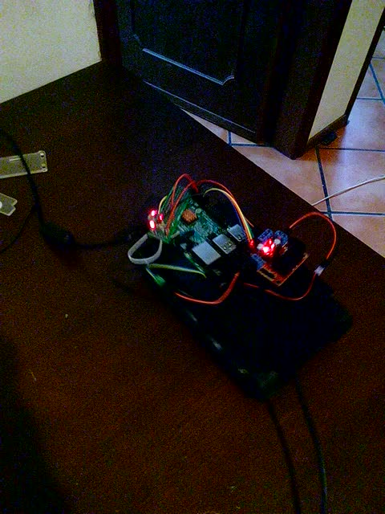

\stopcols

# Estado atual
## Windows 10 Acabado de Ligar

Consumo de RAM: 2.4GB
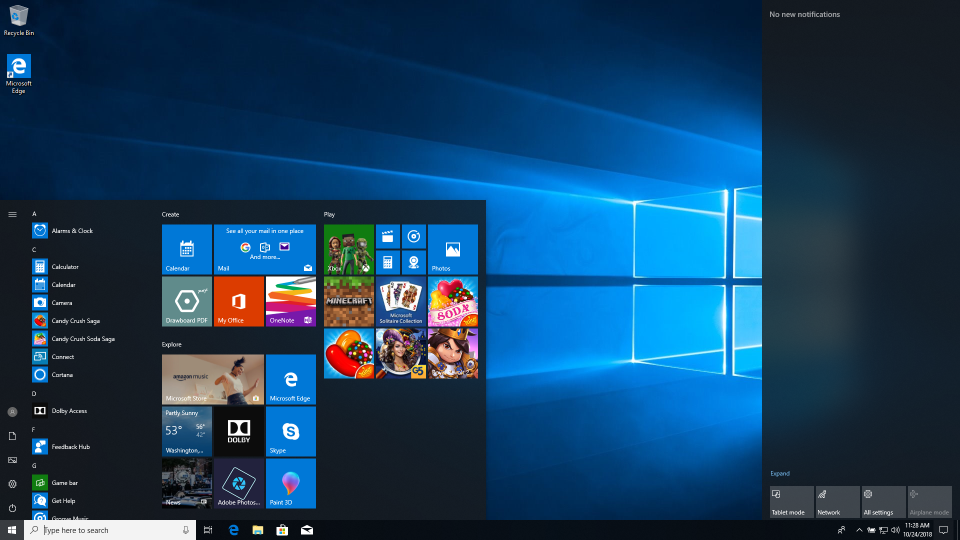

## Firefox com tab de texto

Consumo de RAM: 514MB
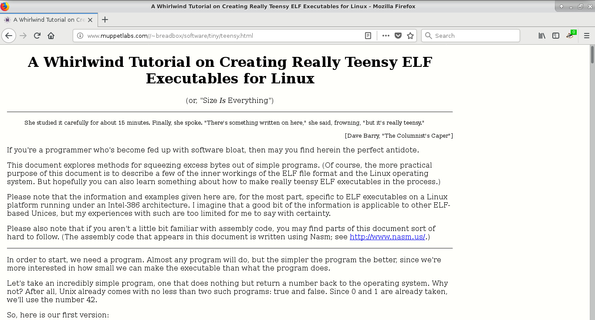

## Intellij IDEA Acabado de Abrir

Consumo de RAM: 848MB
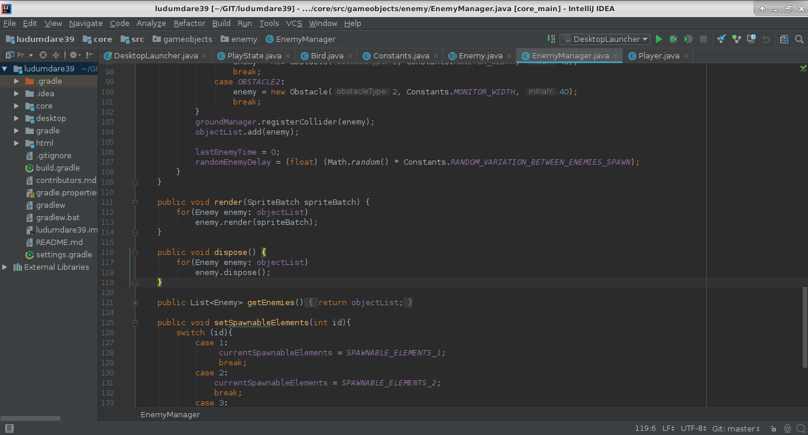

## Discord

Consumo de RAM: 503.1MB
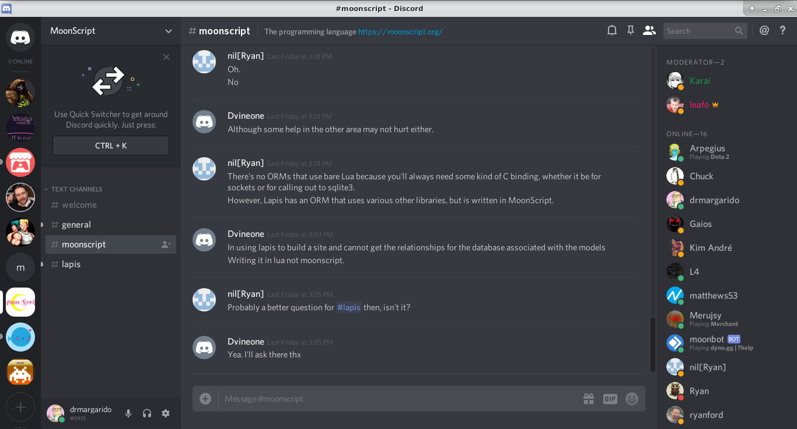

## Porque isto acontece?

* Empresas procuram sempre maximizar as funcionalidades que conseguem obter com o tempo dos programadores 

* "O hardware é barato"

* A maioria dos programadores trabalham em sistemas relacionados com a web.

* Software com muitas funcionalidades em vez de uma filosofia minimalista.

* "Write programs that do one thing and do it well."

# Foco de Análise

## Recursos

* Windows ocupa para cima de 2GB e mesmo o Ubuntu atual ocupa quase 1GB de RAM.

* 20MB de RAM é quanto ocupa um servidor OpenBSD acabado de instalar.

## Comparação

* Servidor que tem interface de linha de comandos vs um sistema com ambiente gráfico completo.

* 40x mais RAM, temos de tentar reduzir o máximo que conseguirmos.

# Consumos Atuais 

## Metodologia

* Pesquisa de toolkit gráficos.

* Implementação de aplicação de notas.

* Inserção de notas no em ficheiro e a sua pesquisa.

* Em cada teste vamos medir:
    - Utilização de memória RAM
    - Simplicidade de implementação
    - Plataformas Suportadas

## Regras

* Tamanho de janela 400x300.

* Implementar apenas a interface usando o toolkit gráfico.

## Mockup da Aparência Desejada

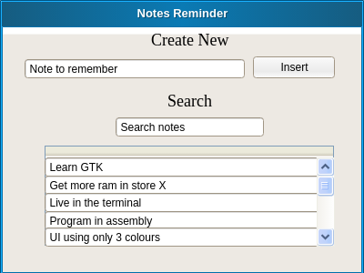

# Aplicação de Notas - GKT
## Apresentação

\begincols{}
\column{0.60\textwidth}

* Criado em 1998.
* Implementado em C.
* Desenvolvido pelo GNOME Project.
* Maioria dos ambientes gráficos mais utilizados em linux utilizam gtk.

\column{0.38\textwidth}

\stopcols

---

## Resultado

\begincols{}

\column{0.49\textwidth}
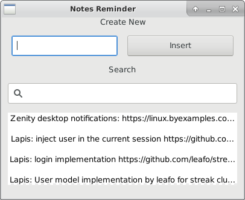

\column{0.49\textwidth}
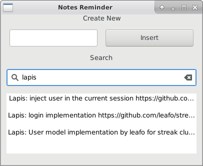

\stopcols

---

## Avaliação
* Utilização de memória RAM - 26.54MB
* Plataformas Suportadas - GNU/Linux, Unix, Windows e Mac OS X
* Simplicidade de implementação:
    - Widgets baseados em GtkWidget.
    - Manual de fácil pesquisa e com boa documentação.
    - Glade para construção de interface só com drag and drop.
    - Trabalhoso usar as caixas de layout que são para definir posição dos widgets.

# Aplicação de Notas - Swing
## Apresentação
\begincols{}
\column{0.60\textwidth}

* Criado em 1997
* Implementado em Java
* Alternativa lightweight ao java AWT
* Desenha os próprios widgets sem utilizar os do sistema

\column{0.38\textwidth}
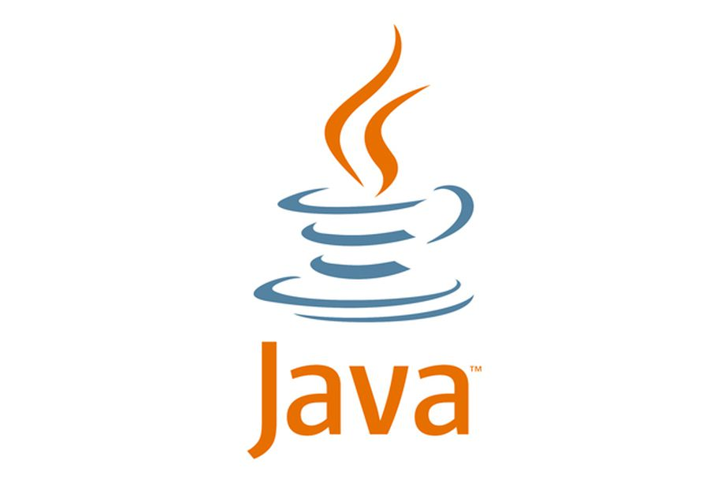

\stopcols

---

## Resultado

\begincols{}

\column{0.49\textwidth}
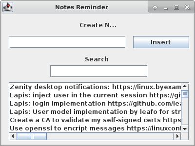

\column{0.49\textwidth}
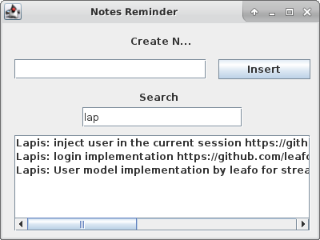

\stopcols

---

## Avaliação
* Utilização de memória RAM - 55.60MB
* Plataformas Suportadas - Platform-Independent
* Simplicidade de implementação:
    - Documentação nos standards do java mas sem pesquisa rápida.
    - Escassos exemplos de utilização.
    - Utilização simples permite posicionamento usando layouts e posicionamento directo na frame.

# Aplicação de Notas - FLTK
## Apresentação

\begincols{}
\column{0.60\textwidth}

* Criado em 1998
* Implementado em C++
* Usa um design mais leve e restringe-se apenas à funcionalidade de GUI
* Normalmente linkado de forma estática

\column{0.38\textwidth}

\stopcols

---

## Resultado

\begincols{}

\column{0.49\textwidth}

\column{0.49\textwidth}
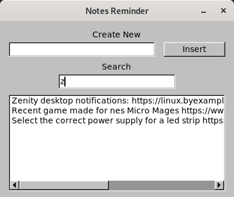

\stopcols

---

## Avaliação

* Utilização de memória RAM - 9.84MB
* Plataformas Suportadas - GNU/Linux, Unix, Windows, macOS, AmigaOS 4
* Simplicidade de implementação:
    - Desenho de elementos na interface simples
    - Gestão de linhas e margens precisou de calculos manuais
    - Documentação tem os widgets bem documentados e aborda a maioria dos casos de uso 
    - FLUID permite construir a interface com drag and drop

# Comparação de resultados
## Comparação

\begincols{}

\column{0.30\textwidth}

\column{0.30\textwidth}

\column{0.30\textwidth}

\stopcols

# Dados de outros casos

## Electron

\begincols{}

\column{0.70\textwidth}

* Hello World utiliza 125MB de RAM
* Rapidamente flutua para valores mais altos
* Chromium com aplicação no topo

\column{0.20\textwidth}

\stopcols

---

## Electron Example

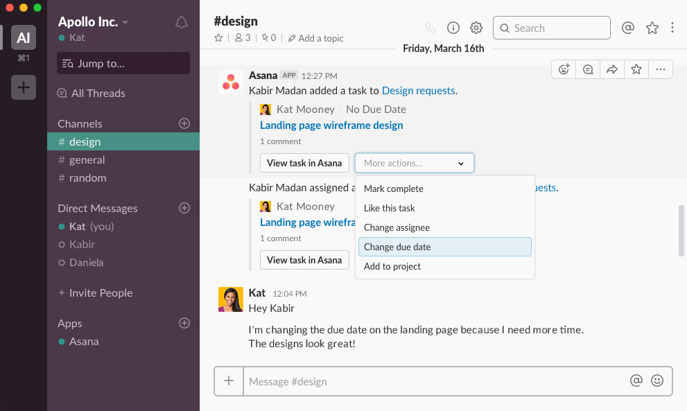

---

## Tekui

\begincols{}

\column{0.70\textwidth}

* Hello World utiliza 9.8MB de RAM
* Utiliza Lua para scripting
* Permite mudar estilos com CSS
* Cross-Platform

\column{0.20\textwidth}

\stopcols

---

## Tekui Example

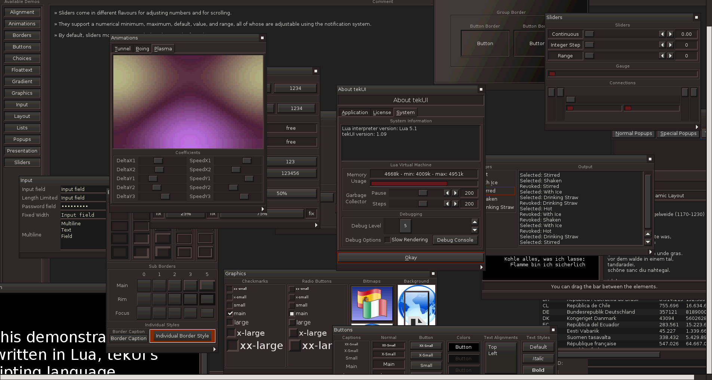

---

## Wayland Client

\begincols{}

\column{0.70\textwidth}

* Hello World utiliza - 868KB de RAM
* Disponibiliza um pixelbuffer
* É preciso implementar toda a stack
* Alternativa Wayland + ImGui

\column{0.20\textwidth}

\stopcols

# Outras Alternativas para Testar

## Com muitas funcionalidades

* QT
* .NET

## Lightweight

* tk
* motif
* IUP
* SDL

## Sistema

* Win32
* X.org

# Conclusões

## Conclusões

* Toolkits mais apelativos
* Maximizar a produtividade
* Cross-platform
* É possivel reduzir o consumo de memória

# Motivação

## Futuro

* Melhorar o software das empresas
* Manter o raspberry como máquina de trabalho durante mais uns 5 anos
* Não ter de trocar de hardware de 2 em 2 anos

## Software Minimalista

* [suckless](https://suckless.org/)
* [ALTERNATIVES](https://github.com/mayfrost/guides/blob/master/ALTERNATIVES.md)
* [harmful.cat-v](http://harmful.cat-v.org/software/)
* [Luke Smith](https://lukesmith.xyz/programs.html)
* [Linux Rice](https://wiki.installgentoo.com/index.php/GNU/Linux_ricing)

# Questões

## Contactos

\begincols{}

\column{0.64\textwidth}

* Email: 
	- drmargarido@gmail.com
* Apresentação: 
	- [https://github.com/drmargarido/minimize_memory](https://github.com/drmargarido/minimize_memory)

* Github: 
	- [https://github.com/drmargarido](https://github.com/drmargarido)
* Bitbucket: 
	- [https://bitbucket.org/Alface0/](https://bitbucket.org/Alface0/)
* Itch.io: 
	- [https://drmargarido.itch.io/](https://drmargarido.itch.io/)

\column{0.35\textwidth}

\stopcols
