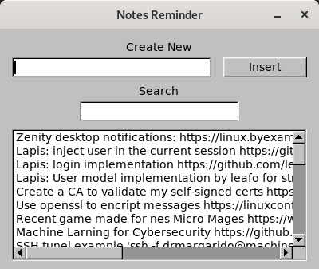

## Indice

1. Problema
2. Estado atual
3. Foco de Análise
4. Consumos atuais
5. Comparação de resultados
6. Outras Alternativas
7. Conclusões
8. Motivação
9. Questões

# Problema

## Geral
* Quando temos um computador novo ele é rápido, mas ao longo do tempo vai ficando mais lento e mesmo limpando, formatando, passados uns anos, temos de comprar um novo. Quem diz computador, diz telemovel, tablet, etc. Porque os nossos equipamentos ficam assim mais lentos ao longo do tempo?

* A verdade é que não ficam, até pode haver algum desgaste em algumas peças do equipamento e isso afecte a velocidade, mas nas situações normais a velocidade do computador vai manter-se.

* O que acontece é que o software que usamos diariamente, está cada vez mais pesado e a gastar mais recursos.

* E usufruimos assim tanto de mais funcionalidades do que era usado à uns 5 ou 10 anos atras?

## Minha Workstation

\begincols{}

\column{0.49\textwidth}

* 1GB de RAM
* 8GB de armazenamento
* 4× ARM Cortex-A53, 1.2GHz
* 2 Motores 92RPM
* Robot Tank Chasis

\column{0.49\textwidth}

\stopcols

# Estado atual
## Windows 10 Acabado de Ligar

Consumo de RAM: 2.4GB

## Firefox com tab de texto

Consumo de RAM: 514MB

## Intellij IDEA Acabado de Abrir

Consumo de RAM: 848MB

## Discord

Consumo de RAM: 503.1MB

## Porque isto acontece?

* Empresas procuram sempre maximizar as funcionalidades que conseguem obter com o tempo dos programadores que tem, melhorar utilização de recursos está sempre no fundo da lista de prioridades. Quando algum ponto sobre isso é levantado a resposta mais comum é - "O hardware é barato".

* A maioria dos programadores trabalham em sistemas relacionados com a web, que é um dos ecosistemas mais pesados. Sendo que é a tecnologia que as pessoas conhecem, quando começam a implementar outras aplicações mesmo que sejam nativas vão procurar usar o que já sabem.

* Cada software, especialmente os softwares proprietários, implementa regularmente uma grande quantidade de funcionalidades em vez de seguir uma filosofia mais minimalista como a do UNIX - "Write programs that do one thing and do it well."

# Foco de Análise

## Recursos

* Os sistemas desktop são pesados, Windows ocupa para cima de 2GB e mesmo o Ubuntu atual ocupa quase 1GB de RAM.

* 20MB de RAM é quanto ocupa um servidor OpenBSD acabado de instalar.

## Comparação

* Claro que comparar um servidor que tem interface de linha de comandos com um sistema com ambiente gráfico completo é uma comparação injusta.

* Mas se essa é a diferença principal que faz o sistema ocupar 40x mais RAM, temos de tentar reduzir o máximo que conseguirmos.

# Consumos Atuais 

## Metodologia
* De modo a entender melhor quais sistemas são mais leves ou mais pesados e para conhecermos mais toolkit gráficos decidiu-se a implementação de uma aplicação de notas usando várias ferramentas diferentes.

* A aplicação deve permitir a inserção de notas no nosso ficheiro de notas e a sua pesquisa.

* Em cada teste vamos medir:
    - Utilização de memória RAM
    - Simplicidade de implementação
    - Plataformas Suportadas

## Regras

* Visto que cada pixel no ecrã vai ocupar memória definiu-se que o tamanho da aplicação vai ser de 400x300

* De modo a que a lógica de inserção e pesquisa de notas não nos influêncie o tamanho dos testes, foram criados dois bash scripts para essas funcionalidades, sendo que cada teste vai implementar apenas a interface usando o toolkit gráfico pretendido.

## Mockup da Aparência Desejada

## Aplicação de Notas - GKT
### Apresentação

\begincols{}
\column{0.60\textwidth}

* Criado em 1998
* Implementado em C
* Desenvolvido pelo GNOME Project
* Maioria dos ambientes gráficos mais utilizados em linux utilizam gtk

\column{0.38\textwidth}

\stopcols

---

### Resultado

\begincols{}

\column{0.49\textwidth}

\column{0.49\textwidth}

\stopcols

---

### Avaliação
* Utilização de memória RAM - 26.54MB
* Plataformas Suportadas - GNU/Linux, Unix, Windows e Mac OS X
* Simplicidade de implementação:
    - Todos os widgets são baseados no tipo GtkWidget o que facilita a percepção de como podem ser usados.
    - O manual de referência do site deles é de fácil pesquisa e contem boa documentação de todos os widgets.
    - A implementação por código deu-nos controlo total do programa, mas podiamos usar o glade que permite a construção de interfaces gtk só com drag and drop.
    - O unico ponto que deu mais trabalho a conseguir gerir foram as caixas de layout que são utilizadas para definir a posição dos widgets.

## Aplicação de Notas - Swing
### Apresentação
\begincols{}
\column{0.60\textwidth}

* Criado em 1997 pela Sun Microsystems e pela Netscape Communications Corporation
* Implementado em Java
* Procura ser uma alternativa lightweight em relação ao java AWT
* Desenha os próprios widgets sem utilizar os do sistema

\column{0.38\textwidth}

\stopcols

---

### Resultado

\begincols{}

\column{0.49\textwidth}

\column{0.49\textwidth}

\stopcols

---

### Avaliação
* Utilização de memória RAM - 55.60MB
* Plataformas Suportadas - Platform-Independent
* Simplicidade de implementação:
    - Documentação nos standards do java mas sem pesquisa rápida.
    - Escassos exemplos de utilização.
    - Utilização simples permite posicionamento usando layouts e posicionamento directo na frame.

## Aplicação de Notas - FLTK
### Apresentação

\begincols{}
\column{0.60\textwidth}

* Criado em 1998
* Implementado em C++
* Usa um design mais leve e restringe-se apenas à funcionalidade de GUI
* Normalmente linkado de forma estática

\column{0.38\textwidth}

\stopcols

---

### Resultado

\begincols{}

\column{0.49\textwidth}

\column{0.49\textwidth}

\stopcols

---

### Avaliação

* Utilização de memória RAM - 9.84MB
* Plataformas Suportadas - GNU/Linux, Unix, Windows, macOS, AmigaOS 4
* Simplicidade de implementação:
    - O desenho de elementos na interface foi simples de começar pois utiliza uma abordagem simples de desenhar directamente nas posições
    - A gestão de linhas e margens precisou de calculos manuais o que faz com que a aplicação seja mais trabalhosa de mudar de ajustar a escala quando for necessário
    - A documentação tem todos os widgets bem documentados e eles abordam a maioria dos casos de uso 
    - Para facilitar a implementação pode ser utilizada a ferramenta FLUID que permite construir a interface com drag and drop

# Comparação de resultados
## Comparação

\begincols{}

\column{0.30\textwidth}

\column{0.30\textwidth}

\column{0.30\textwidth}

\stopcols

## Dados de outros casos

### Electron

\begincols{}

\column{0.70\textwidth}

* Hello World utiliza 125MB de RAM
* Rapidamente flutua para valores mais altos
* Chromium com aplicação no topo

\column{0.20\textwidth}

\stopcols

---

### Electron Example

---

### Tekui

\begincols{}

\column{0.70\textwidth}

* Hello World utiliza 9.8MB de RAM
* Utiliza Lua para scripting
* Permite mudar estilos com CSS
* Cross-Platform

\column{0.20\textwidth}

\stopcols

---

### Tekui Example

---

### Wayland Client

\begincols{}

\column{0.70\textwidth}

* Hello World utiliza - 868KB de RAM
* Disponibiliza um pixelbuffer
* É preciso implementar toda a stack
* Alternativa Wayland + ImGui

\column{0.20\textwidth}

\stopcols

# Outras Alternativas para Testar

## Com muitas funcionalidades

* QT
* .NET

## Lightweight

* tk
* motif
* IUP
* SDL

## Sistema

* Win32
* X.org

# Conclusões

## Conclusões

* Toolkits mais apelativos
* Maximizar a produtividade
* Cross-platform
* É possivel reduzir o consumo de memória

# Motivação

## Futuro

* Melhorar o software das empresas
* Manter o raspberry como máquina de trabalho durante mais uns 5 anos
* Não ter de trocar de hardware de 2 em 2 anos

## Software Minimalista

* [suckless](https://suckless.org/)
* [ALTERNATIVES](https://github.com/mayfrost/guides/blob/master/ALTERNATIVES.md)
* [harmful.cat-v](http://harmful.cat-v.org/software/)
* [Luke Smith](https://lukesmith.xyz/programs.html)
* [Linux Rice](https://wiki.installgentoo.com/index.php/GNU/Linux_ricing)

# Questões

## Contactos

\begincols{}

\column{0.64\textwidth}

* Email: 
	- drmargarido@gmail.com
* Apresentação: 
	- [https://github.com/drmargarido/minimize_memory](https://github.com/drmargarido/minimize_memory)

* Github: 
	- [https://github.com/drmargarido](https://github.com/drmargarido)
* Bitbucket: 
	- [https://bitbucket.org/Alface0/](https://bitbucket.org/Alface0/)
* Itch.io: 
	- [https://drmargarido.itch.io/](https://drmargarido.itch.io/)

\column{0.35\textwidth}

\stopcols
